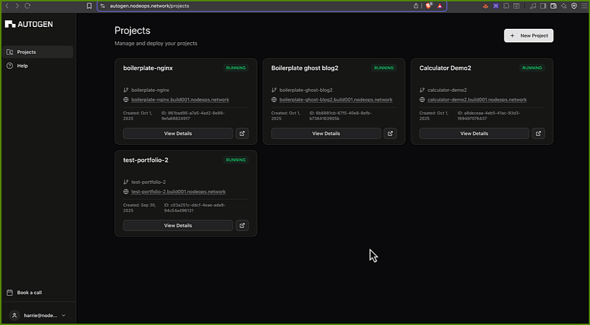

## Image requirements

- Public
- Arch --platform linux/amd64 
> This constraint ensures imported Docker images are built for the host machine architecture.

<!-- 
Testing
image name: ghost:5-alpine

  -p 2368

Need to set environment variables to ensure that it uses SQLite by default (so no external DB needed).

In the environment variables section for your Docker image deployment, enter the following key-value pairs exactly:

NODE_ENV=development

database__client=sqlite3

database__connection__filename=/var/lib/ghost/content/data/ghost.db

database__useNullAsDefault=true

-->

## Deploy a Docker image

## Deploy a Docker image

  
Walk the steps

1. Logged into the app, click on **New Project**.
2. Click on **Deploy Docker Container**.
3. Populate:
	- Image path
	- Port
	- (Optional) project name
4. Click on **Deploy Project**.

