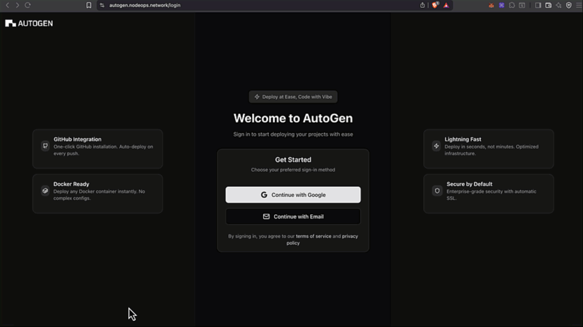

# GitHub integration

The tool integrates with GitHub to allow you to leverage existing repositories.

> Please ensure you respect the licensing of third parties.

This page covers: 

- [Supported frameworks](#supported-frameworks) 
- [Connecting to GitHub](#set-up-github-integration)
- [Amending which repositories are connected](#amend-github-integration)

## Supported frameworks

- Go
- Next.js
- Python
- SvelteKit
- Vite

You may also select **Other/Unknown** as long as you provide the **Dockerfile** in the repository.

## Browse the list of walkthroughs

### Set up GitHub integration

You can connect your GitHub and provide access to all or selected repositories.

  
Show me

1. Logged into the app, click on **New Project**.
2. Click on **Import Github Repository**.
3. Decide between **All repositories** and **Only select repositories**.
4. If selecting, choose the relevant repos (you can always configure the access from GitHub again later).
5. Click on **Install**.
6. Verify according to your GitHub verification method.

> You may need to re-login if this issue was not fixed yet!

### Deploy a GitHub-based project

You may deploy a project from a linked respository.

  
Show me

1. Logged into the app, click on **New Project**.
2. Choose the relevant repo.
3. Click on **Install**.

> You may need to re-login if this issue was not fixed yet!

> Once you have deployed a project, you may [work with an AI assistant on that code in the sandbox](../Sandbox/sandbox-support.md#get-started-with-the-ai-coding-agent).

<!-- todo -->

### Amend GitHub integration

From your GitHub account, you may revoke the app's access to your account or modify which repositories it can access.

  
Show me

1. Logged into your GitHub > Your profile pic > Settings → [Integrations] Applications.
2. Select the tab **Installed GitHub Apps** > NodeOps Build0 > click Configure
3. You may:
- Suspend your installation: click **Suspend**
- Uninstall the app: click **Uninstall**
- Curate the repository access list

