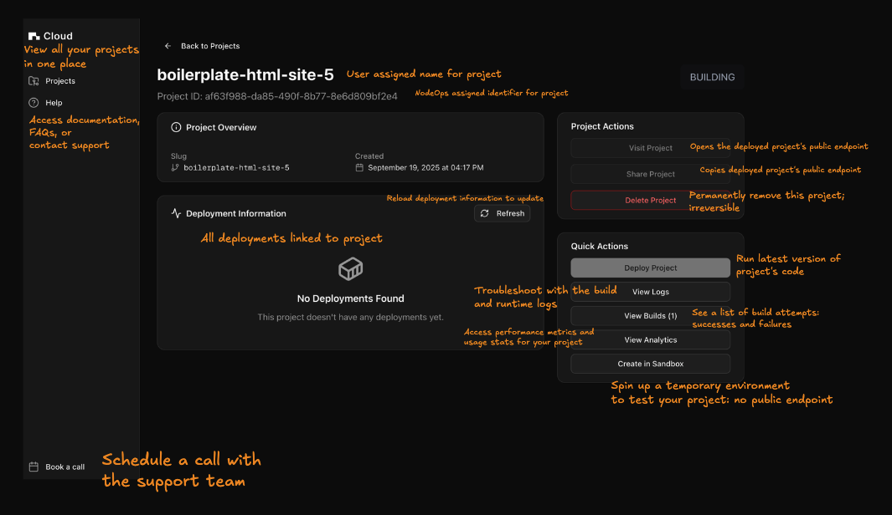
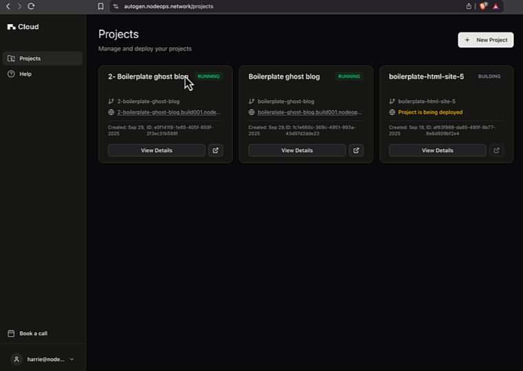

# Projects: a single page to manage your deployments

## Left Sidebar

#### Projects: View all your projects in one place

#### Help: Access documentation, FAQs, or contact support

#### Book a call: Schedule a call with the support team

## Main Panel: Center

#### Project title: User assigned name for project

#### Project ID: NodeOps-assigned identifier for project

#### Created Date

#### Deployment Information: All deployments linked to project

#### Refresh button: Reload deployment information to update

## Right Panel: Project Actions

#### Visit Project: Opens the deployed project's public endpoint

#### Share Project: Copies deployed project's public endpoint

#### Delete Project: Permanently remove this project; irreversible

  

    
Show me

  1. Logged into the app, click on **Projects**.
  2. Select the instance you want to delete and click **View Details**.
  3. From Project Actions, click **Delete Project**.
  4. Confirm the delete.

  > You may need to reload for the project deletion to register in the UI.

  

  

## Right Panel: Quick Actions

#### Deploy Project: Run latest version of project's code

#### View Logs: Troubleshoot with the build and runtime logs

#### View Builds: See a list of build attempts - successes and failures

#### View Analytics: Access performance metrics and usage stats for your project

#### Create in Sandbox

- Spin up a temporary environment to test your project: no public endpoint
- Vibe code with AI

## Top Right

#### Build status label: Indicates project's launch status