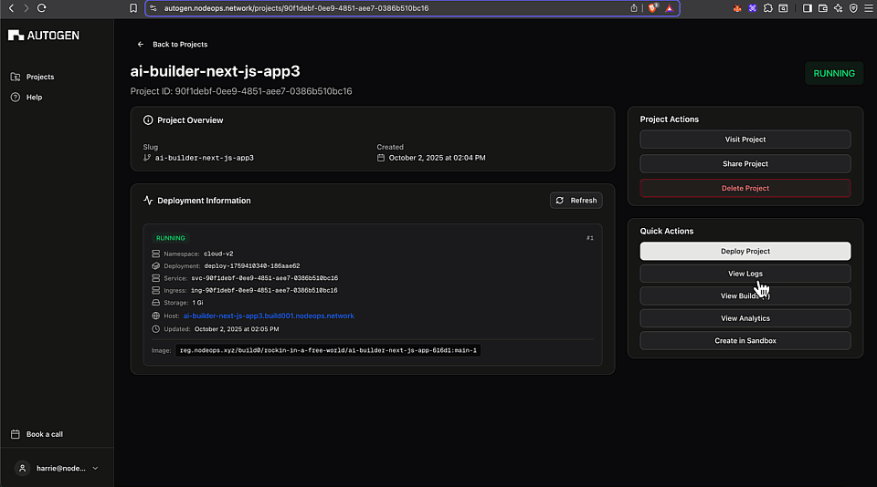

# Sandbox coding

In AutoGen, you can create a sandbox environment to work with your codebase.

This page covers: 

- [Getting started](#get-started-with-the-sandbox) 
- [Using the AI](#get-started-with-the-ai-coding-agent)
- [Configuring Git](#configure-git)

## Prerequisites

- [GitHub repository linked](../GitHub-Integration/github-support.md#set-up-github-integrtation), [deployed](../GitHub-Integration/github-support.md#deploy-a-github-based-project), and in **Running** status.

## Get started with the sandbox

1. Follow the [GitHub Get Started](../GitHub-Integration/github-support.md) to connect at least one repository.

2. Once the container for this repository is successfully running, click **Create in Sandbox**.

> You may need to reload page ahead of the next step.

3. Click **Edit in Sandbox**. 

> A vanilla VS code instance will open.

## Get started with the AI coding agent

AutoGen assists you to code your projects with an AI assistant embedded in the sandbox.

  
Show me

  ### Prerequisites

- Connected repository
> Follow the [GitHub Get Started](../GitHub-Integration/github-support.md).
- Deployable app
> Follow the [AI agent guide](./ai-agent-guide.md) if you need a boilerplate app.

1. Click **Create Sandbox**.
> You may need to reload the page before the next step.

2. Click **Edit in Sandbox**. 
> A vanilla VS code instance will open.

3. Click the final icon on the LHS menu bar, a kangaroo.
> You are now ready to build out your app with the AI assistant.

## Configure the VS code instance

### Configure Git

If you want to commit code changes back to the original repository, you must configure git to identify your profile.

  
Show me

1. From a sandbox instance, work your code until you have changes to commit.
2. Open a terminal and run `git config user.name` if this returns null, you did not yet setup a git user.
3. Get your GitHub username and the email associated with the GitHub profile. Then run the following commands in your terminal, substituting your actual username and emaill:
`git config --global user.name` 
`git config —global user.email`

> The global flag is optional.

4. Using VS Code's git plugin, click **Commit** and **Sync Changes**.
5. Follow the prompts to connect this VS Code instance with your repository.

> The changes will be synced with the source repository. You can verify this on GitHub.

